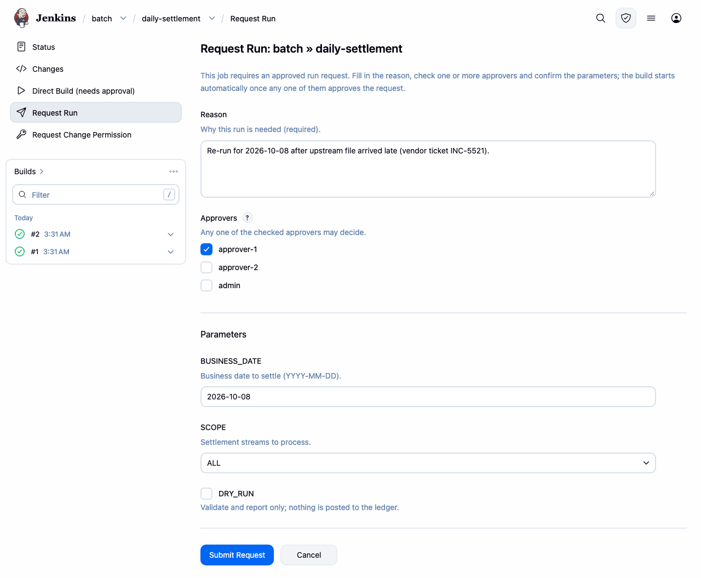
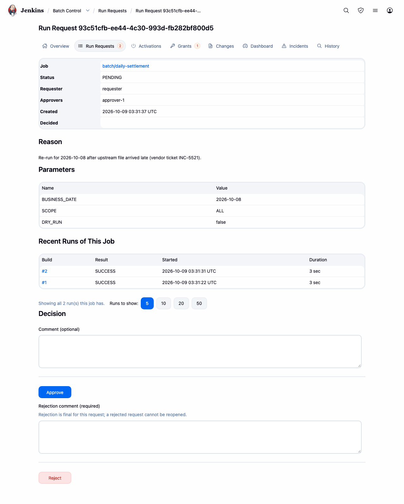
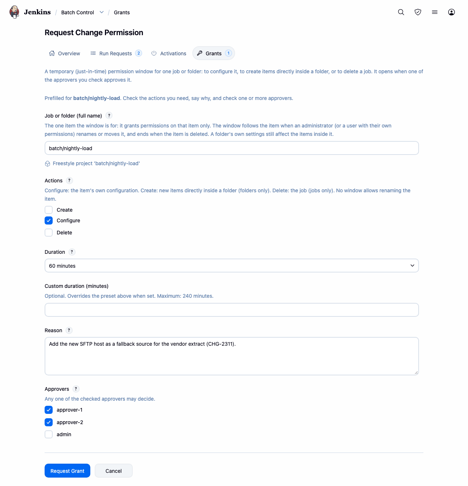
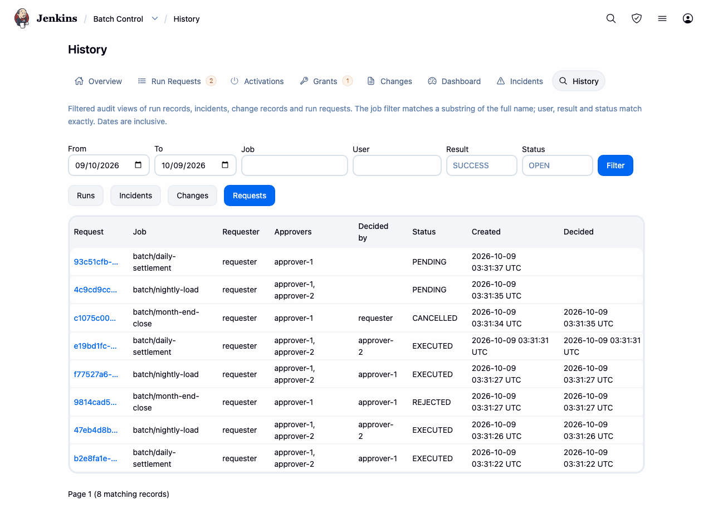
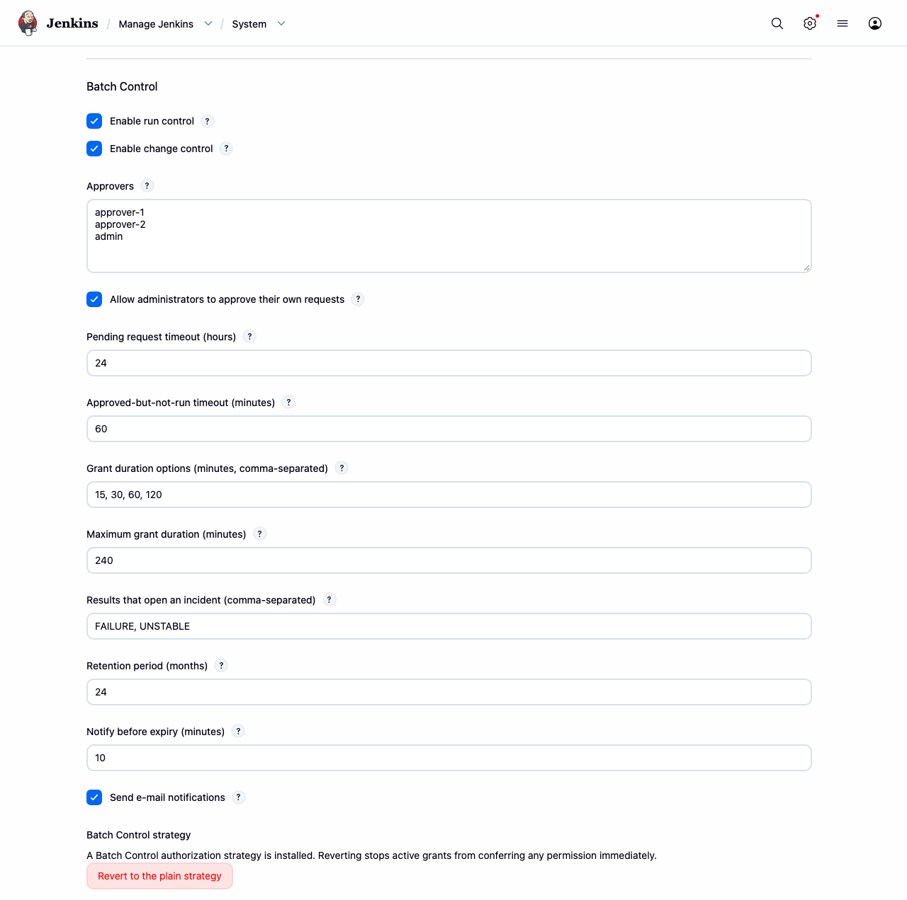

이 문서는 정본인 영문 [README.md](README.md)의 한국어 번역이며 2026-10-09(커밋 420cfaa) 기준입니다. 두 문서가 어긋나면 영문판이 맞습니다.

# Batch Control

CI 서버가 아니라 **배치 실행 관리 도구**로 운영되는 Jenkins 인스턴스를 위한 실행 승인, 기간
제한 변경 권한, 추가 전용(append-only) 감사 이력.

야간·주기 운영 작업을 Jenkins로 돌리는 팀을 위한 플러그인입니다. Spring Batch 잡, 데이터 적재,
정산 실행, 대조 스크립트 같은 것들입니다. 이런 잡을 사람이 손으로 시작하거나 잡이 하는 일을
바꾸는 것은 운영 변경입니다. Batch Control을 쓰면 보호된 잡의 수동 실행은 지정된 결재자가
승인해야 큐에 들어가는 요청이 되고, 설정 변경에는 스스로 만료되는 권한 창이 필요하며, 실행,
결정, 변경, 실패는 빌드 로테이션보다 오래 남는 저장소에 보관됩니다. 설치만으로 달라지는 것은
없습니다. 두 통제 모두 관리자가 켤 때까지 꺼져 있습니다.

## 주요 기능

- **실행 승인.** 사람이 보호된 잡을 수동으로 실행하면(Build Now, REST, CLI, Replay) 큐 진입
  시점에 거부됩니다. 대신 파라미터와 사유를 담은 실행 요청을 제출하고, 지정된 결재자가 승인한
  뒤에야 빌드가 큐에 들어갑니다.
- **한 번만 쓰이는 승인.** 승인된 빌드는 결재자가 본 파라미터를 비밀번호와 파일까지 그대로
  받습니다. 승인은 큐 투입 한 번에 소비되므로 재생하거나 다시 큐에 넣거나 재빌드할 수 없습니다.
- **결재자 집합.** 요청 하나에 자격 있는 결재자를 여러 명 지정할 수 있습니다. 그 집합만 결정할
  수 있고, 첫 결정이 요청을 닫습니다. 자기 요청의 자가 결재는 거부됩니다(관리자에 대해서는
  설정 가능).
- **활성화.** 실행 통제가 켜진 동안 만든 잡은 결재자가 활성화할 때까지 타이머, 업스트림 트리거,
  SCM 트리거, 웹훅으로 실행되지 않습니다. 기존 잡은 일정대로 계속 실행되며,
  `Block cron (timer) triggers`와 `Block upstream triggers`로 개별 잡을 더 엄격하게 만들 수
  있습니다.
- **권한 창.** 상시 권한이 없는 사용자가 잡 하나나 폴더 하나에 대해 `CREATE`, `CONFIGURE`,
  `DELETE`를 제한된 시간 동안 요청합니다. 창은 스스로 닫히고 일찍 회수할 수도 있습니다. 변경
  통제가 켜져 있는 동안에는 관리자를 제외한 모든 사람이 잡을 삭제하려면 `DELETE` 창이
  필요합니다.
- **빌드와 무관한 감사 이력.** 두 통제 중 하나라도 켜져 있으면 실행, 요청, 결정, diff가 붙은
  설정 변경, 실패가 `$JENKINS_HOME/batch-control/` 아래에 추가 전용으로 기록되며, 보존 기간은
  설정할 수 있습니다.
- **인시던트.** 실패하거나 불안정한 실행(대상 결과는 설정 가능)은 콘솔 마지막 100줄과 함께
  인시던트(오류 건)를 엽니다. 인시던트는 확인, 해결, 코멘트, 요청을 통한 재실행으로 처리합니다.
- **이력과 대시보드.** 기간, 잡, 사용자, 결과, 상태별 필터, CSV 내보내기, 월별 집계.
- **알림.** Mailer 플러그인을 통한 선택적 이메일(기본값은 꺼짐)과, 다른 채널을 위한 확장 지점.
- **기존 보안 설정과 맞물림.** 변경 통제는 Matrix Authorization Strategy와 Role-based
  Authorization Strategy의 Batch Control 변형을 통해 동작하며, 각 변형은 원래 전략의 설정을
  그대로 유지합니다. 전역 설정과 전략 변형은 Configuration as Code로 설정할 수 있습니다.

## 스크린샷

보호된 잡의 **Request Run**(실행 요청) 화면: 파라미터, 사유, 요청할 결재자.



결재자가 보는 대기 중인 실행 요청과 **Approve**(승인), **Reject**(반려) 버튼.



권한 창 요청 양식.



실행 기록이 쌓인 Batch Control 대시보드.



전역 설정의 Batch Control 섹션.



## 요구 사항

- **Jenkins 2.568.3 이상**(플러그인이 컴파일되는 기준선). 이 Jenkins 라인이 지원하는
  **Java 21 또는 25**에서 실행합니다.
- **필수 플러그인:** `cloudbees-folder`, `ionicons-api`, `caffeine-api`. 플러그인
  관리자(직접 빌드한 것을 설치할 때는 Deploy Plugin)가 알아서 해결합니다.
- **권한 매트릭스를 그려 주는 권한 전략**, 예를 들어 Matrix Authorization Strategy나 Role-based
  Authorization Strategy. Batch Control의 다섯 권한은 이런 전략에서만 보이므로, Jenkins 내장
  "Logged-in users can do anything"에서는 이 권한들을 할당할 화면이 없습니다.

아래 플러그인과의 연동은 선택 사항이라 없어도 Batch Control은 로드됩니다. 다만 설치되어 있다면
Batch Control이 컴파일된 버전 이상이어야 하며, Jenkins가 플러그인을 로드할 때 이를 강제합니다.

| 선택 플러그인 | 최소 버전 |
|---|---|
| `matrix-auth` | 3.3 |
| `role-strategy` | 927.v9cf5527c4085 |
| `configuration-as-code` | 2121.v86fe99d4b_b_a_b_ |
| `mailer` | 534.v1b_36f5864073 |
| `rebuild` | 338.va_0a_b_50e29397 |
| `file-parameters` | 433.va_0b_80359d54d |

이 중 하나라도 더 오래된 버전이 설치되어 있으면 그 플러그인을 업그레이드할 때까지 Batch
Control이 로드되지 않습니다. **Manage Jenkins → Plugins → Available plugins**에서 Batch Control을
설치하면 필요한 업그레이드를 함께 제안합니다. **Deploy Plugin**으로 `.hpi`를 올리면 제안하지
않으므로, 해당 플러그인을 먼저 업그레이드하십시오.

## 설치

**Manage Jenkins → Plugins → Available plugins**에서 *Batch Control*을 검색해 설치하거나, 직접
빌드한 것을 **Manage Jenkins → Plugins → Advanced settings → Deploy Plugin**에서 올립니다. 소스
빌드에는 Maven과 JDK 21 또는 25가 필요합니다.

```sh
mvn clean package   # target/batch-control.hpi 생성
mvn hpi:run         # http://localhost:8080/jenkins 에 로컬 Jenkins
```

## 빠른 시작

보호된 잡 하나, 요청자 한 명, 결재자 한 명으로 진행합니다. 각 단계의 자세한 내용은
[사용자 가이드](docs/USER-GUIDE.md#configuration)에 있습니다(영문. 사용자 가이드와 제약 목록은
영문으로만 제공됩니다).

1. **통제를 켭니다.** **Manage Jenkins → System**의 **Batch Control** 섹션(또는
   `/batch-control-configuration/`)에서 **Enable run control**을 체크하고, 권한 창이 필요하면
   **Enable change control**도 체크합니다. **Approvers**에 승인할 수 있는 사용자 ID를 한 줄에
   하나씩 입력하고 저장합니다. 두 스위치 모두 기본값은 꺼짐이며, 바꿀 때마다 기록됩니다.
2. **Batch Control 전략을 선택합니다(변경 통제만 해당).** 변경 통제를 켜면 **Manage Jenkins**의
   모니터가 **Install the Batch Control variant** 버튼을 보여 줍니다. 이 버튼은 기존 matrix-auth
   또는 role-strategy 설정을 항목 하나 빠짐없이 변환합니다(전역 매트릭스 전략에서 넘어온다면
   [먼저 이 내용을 읽으십시오](docs/USER-GUIDE.md#2-select-a-batch-control-authorization-strategy)).
   이 단계가 없으면 승인된 창은 아무 권한도 주지 않습니다. 실행 통제에는 필요 없습니다.
3. **권한을 할당합니다.** 요청자에게는 `Overall/Read`, `Item/Read`, `BatchControl/Request`를
   주고, 권한 창이 필요하면 `BatchControl/RequestGrant`도 줍니다. 결재자에게는 `Overall/Read`,
   `Item/Read`, `BatchControl/Approve`, `BatchControl/ViewHistory`를 주고, Approvers 목록에
   들어 있는지 확인합니다.
4. **잡을 보호합니다.** 잡 설정의 **Batch Control** 섹션에서 **Require approval to run**을
   체크합니다. 실행 통제가 켜진 동안 만든 잡은 처음부터 체크되어 있습니다.
5. **실행을 요청합니다.** 요청자로 잡을 열고 사이드바에서 **Request Run**을 고릅니다. 파라미터와
   사유를 입력하고, 결재자를 한 명 이상 체크한 뒤 **Submit Request**를 누릅니다.
6. **승인합니다.** 결재자로 페이지 헤더의 **☰**(More actions) 메뉴에서 **Batch Control**을 열고
   **Run Requests**에서 요청을 연 뒤 **Approve**를 누르거나, 코멘트를 달아 **Reject**합니다.
   승인되면 저장된 파라미터로 빌드가 큐에 들어갑니다.
7. **무인 실행이 필요한 잡을 활성화합니다.** 플러그인을 설치할 때 이미 있던 잡과 실행 통제가
   꺼진 동안 만든 잡은 일정대로 계속 실행됩니다. 실행 통제가 켜진 동안 만든 잡은 활성화될
   때까지 타이머, 업스트림 트리거, SCM 트리거, 웹훅으로 실행되지 않습니다. 잡 페이지의
   **Request activation**으로 활성화를 요청하고 결재자의 승인을 받으십시오. 5, 6단계처럼 승인된
   수동 실행에는 활성화가 필요 없습니다.

변경 통제가 켜져 있으면, 잡에 대한 `Item/Configure`가 없는 사용자는 그 잡의 사이드바에서
**Request Change Permission**(변경 권한 요청)을 찾을 수 있습니다. 결재자가 **Grants** 화면에서 그
창을 승인하면, 그 사용자는 창이 만료될 때까지 잡을 바꿀 수 있습니다.

## 권한

| 권한 | 허용하는 것 |
|---|---|
| `BatchControl/Request` | 실행, 활성화, 보류 요청 생성(그 잡의 `Item/Read` 필요, `Item/Build`는 필요 없음) |
| `BatchControl/Approve` | 실행, 활성화, 보류, 권한 창 요청의 승인 또는 반려 |
| `BatchControl/RequestGrant` | 임시 변경 권한 요청 |
| `BatchControl/ViewHistory` | 모든 잡에 대한 이력 화면, 대시보드, CSV 내보내기 조회 |
| `BatchControl/Manage` | 전역 설정 관리와 권한 창 회수 |

`Manage`는 `Overall/Administer`가 함의하고, 나머지 넷을 함의합니다. 승인이 필요한 잡에는
`Item/Build` 대신 `Request`를 부여하십시오. 실행 통제가 켜져 있는 동안 그런 잡에서는 직접 빌드
경로가 모두 거부됩니다. `ViewHistory`는 `Item/Read` 검사 없이 인스턴스 전체의 감사 기록을 읽는
권한입니다. 관리자는 막히지 않고 기록됩니다.
[전체 규칙](docs/USER-GUIDE.md#3-assign-the-permissions).

## 문서

- [사용자 가이드](docs/USER-GUIDE.md):
  [플러그인이 필요한 이유](docs/USER-GUIDE.md#why),
  [두 가지 통제](docs/USER-GUIDE.md#the-two-controls),
  [실행 통제가 막는 것](docs/USER-GUIDE.md#what-run-control-stops-and-what-it-does-not),
  [활성화](docs/USER-GUIDE.md#activation-putting-a-job-into-service),
  [설정](docs/USER-GUIDE.md#configuration),
  [화면](docs/USER-GUIDE.md#the-screens),
  [알림과 결재자 집합](docs/USER-GUIDE.md#notifications-and-approver-sets),
  [결정을 바꾸는 제약](docs/USER-GUIDE.md#limitations),
  [다른 방식과의 비교](docs/USER-GUIDE.md#compared-with-other-approaches),
  [로드맵](docs/USER-GUIDE.md#roadmap).
- [알려진 제약](docs/LIMITATIONS.md): 전체 목록입니다. 잡을 자동 생성하는 인스턴스에서 실행
  통제를 켜기 전에
  [Automation and generated jobs](docs/LIMITATIONS.md#automation-and-generated-jobs)(자동화와
  생성된 잡) 절을 읽으십시오.
- 이슈와 기능 요청: <https://github.com/jenkinsci/batch-control-plugin/issues>.

## 기여

이슈와 풀 리퀘스트를 환영하며, 안내서는 [`CONTRIBUTING.md`](CONTRIBUTING.md)입니다. 관례 몇
가지가 통상적이지 않아서 첫 변경 전에 읽어 볼 만합니다. `docs/SPEC.md`는 기능 계약이고(코드와
스펙이 어긋나면 코드가 틀린 것입니다), `docs/DECISIONS.md`에는 확정된 모든 설계 결정의 근거가,
`docs/ARCHITECTURE.md`에는 확장 지점, 패키지 구조, 저장 형식이 있습니다. 이 세 문서는 대부분
한국어로 쓰였고, 새로 추가된 절은 영어입니다.

```sh
mvn clean verify   # 컴파일, 전체 테스트, SpotBugs. 실패 0, 버그 0으로 끝나야 합니다
```

## 보안 취약점 신고

GitHub 이슈는 **열지 마십시오.** Jenkins의
[**SECURITY** 프로젝트](https://issues.jenkins.io/secure/CreateIssueDetails!init.jspa?pid=10180&issuetype=10103)에
`specific-plugin` 컴포넌트로 비공개 신고하고, 요약에 플러그인 이름을 적으십시오. 그렇게 만든
이슈는 신고자와 Jenkins 보안팀에게만 보입니다. 트래커를 쓸 수 없으면
`jenkinsci-cert@googlegroups.com`으로 메일을 보내면 보안팀이 대신 등록해 줍니다. 전체 정책:
<https://www.jenkins.io/security/reporting/>.

## 라이선스

MIT. [`LICENSE`](LICENSE) 참고.
